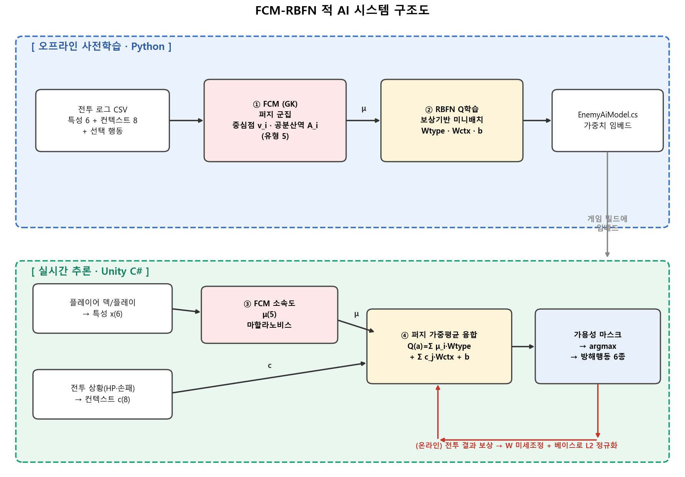
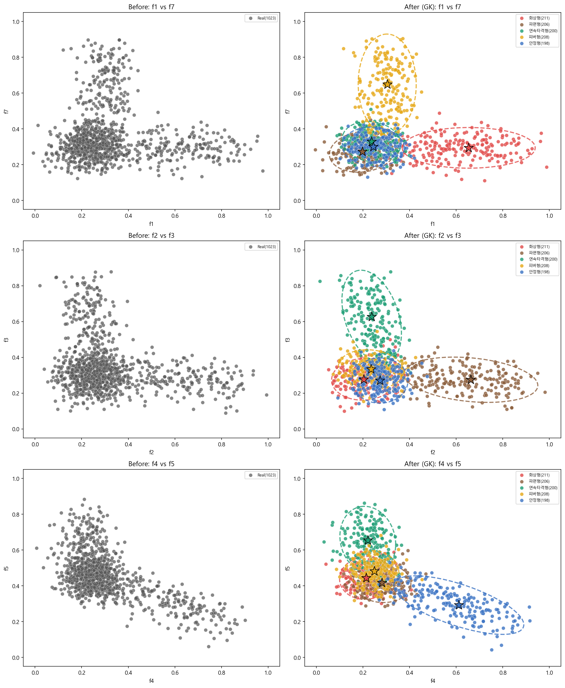
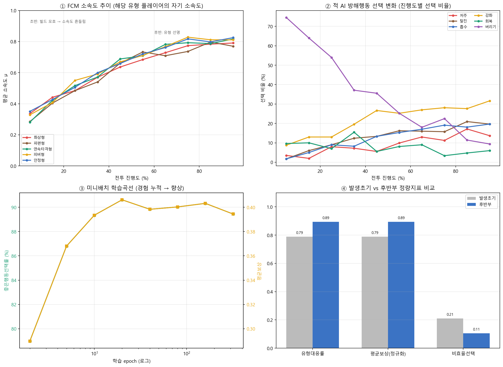
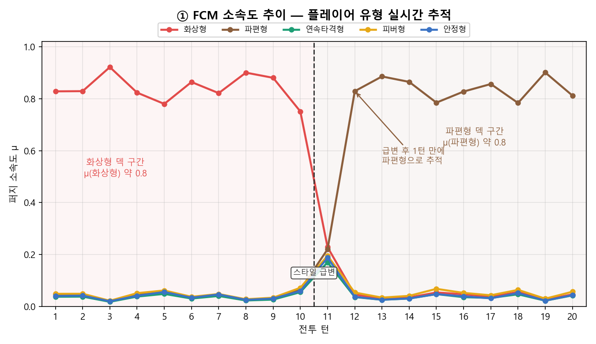
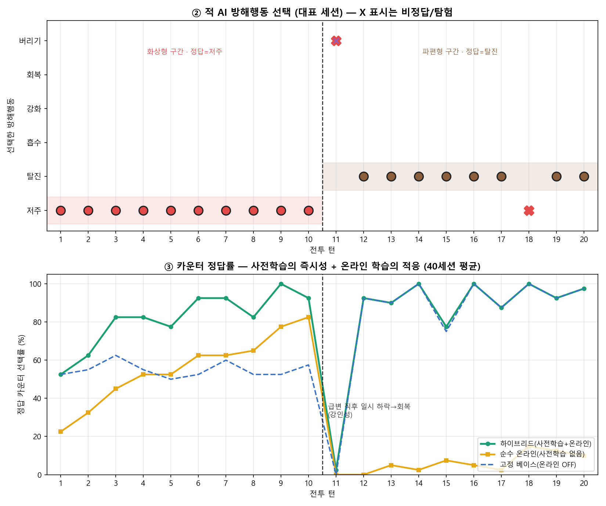

# FCM-RBFN 기반 적응형 적 AI — 설계 및 실험 보고서

> **대상 시스템**: 턴제 덱빌딩 로그라이크의 적(NPC) 방해행동 선택 AI
> **방법론**: FCM(Fuzzy C-Means, Gustafson–Kessel) 패턴 인식 + RBFNN(Radial Basis Function Neural Network) Q-Value 예측의 2단계 하이브리드 구조
> **실험**: 실제 게임에 임베드된 가중치(`Assets/Script/Battle/AI/EnemyAiModel.cs`)를 그대로 사용한 통제 시뮬레이션 (재현 코드: [`make_report.py`](make_report.py))

---

## 📐 1. 게임의 규칙과 플레이어 행동 패턴

### 1.1 전투 규칙 개요
본 게임은 5장의 손패로 카드를 사용해 적과 겨루는 턴제 덱빌딩 로그라이크다. 플레이어는 매 전투에서 자신의 **덱 구성**에 따라 뚜렷한 전략적 성향을 드러내며, 적 NPC는 플레이어의 게이지를 채우거나 덱 순환을 방해하는 **방해행동(disruption)** 으로 대응한다.

핵심 설계 의도는 **"적이 플레이어의 빌드 성향을 읽고, 그에 맞는 카운터 방해행동을 선택한다"** 는 것이다. 단순 무작위 선택이 아니라, 플레이어가 어떤 유형의 덱을 운용하는지를 실시간으로 추정하고 그 약점을 찌르는 행동을 골라야 한다.

### 1.2 플레이어 행동 패턴 — 5가지 덱 성향(유형)
플레이어의 덱 구성 로그(카드별 빈도·속성·코스트)를 6개 특성으로 요약하면, 플레이어는 다음 5가지 성향으로 군집된다.

| 유형 | 핵심 패턴 | 대표 특성 |
|---|---|---|
| **화상형** | 화상(burn) 상태이상 누적으로 지속 피해 | 화상 카드 의존도 높음 |
| **파편형** | 땅·파편 카드로 임시 자원 운용 | 파편 의존도 높음 |
| **연속타격형** | 연쇄·다타격으로 누적 딜 | 연쇄/저코스트 의존 |
| **피버형** | 속성 카드 누적으로 각성(Awaken) 적극 활용 | 피버 사이클 활성 |
| **안정형** | 방어·회복 위주 운영 | 방어 성향 높음 |

플레이어는 단일 유형에 고정되지 않는다. "화상 위주지만 파편도 섞은 덱"처럼 **여러 유형에 부분적으로 걸친 혼합 빌드**가 일반적이며, 카드 보상으로 덱이 바뀌면서 **전투 중 성향이 변하기도** 한다. 이 연속적·혼합적 특성이 퍼지(fuzzy) 접근을 요구하는 근본 이유다.

### 1.3 적 AI의 행동 공간 — 6가지 방해행동
| # | 행동 | 효과 |
|---|---|---|
| 0 | **저주(curse)** | 특정 속성 카드 사용 시 플레이어에게 피해 (반복 사용 억제) |
| 1 | **탈진(exhaust)** | 뽑을 더미에 무속성 쓰레기 카드 삽입 (덱 순환 방해) |
| 2 | **흡수(absorb)** | 플레이어 각성 게이지 감소 |
| 3 | **강화(enhance)** | 적 다음 공격 피해 증가 |
| 4 | **회복(recover)** | 적 HP 회복 (쿨다운 존재) |
| 5 | **버리기(discard)** | 플레이어가 손패 2장을 강제로 버림 |

**문제 정의**: 매 방해 시점에서, 플레이어의 (느리게 변하는) 빌드 성향과 (매 순간 변하는) 전투 상황을 동시에 고려해 6개 행동 중 가장 가치 있는 하나를 선택하라.

---

## 📐 2. 제안하는 AI 아키텍처

### 2.1 시스템 구조도 (블록 다이어그램)



> **구조 요약**: 오프라인(Python)에서 ① FCM 군집과 ② RBFN Q학습으로 가중치를 산출해 `EnemyAiModel.cs`에 임베드하고, 런타임(Unity C#)에서는 ③ 소속도 μ 계산과 ④ 퍼지 가중평균 융합으로 방해행동을 선택한다. 온라인 학습 루프(빨간 화살표)는 전투 결과 보상으로 가중치를 미세조정하되 베이스로의 L2 정규화로 발산을 막는다.

### 2.2 단계별 상세

#### 1단계 — FCM을 통한 패턴 인식
플레이어의 실시간 덱/플레이 로그(화상 의존도 `f1`, 파편 의존도 `f2`, 연쇄 의존도 `f3`, 방어 성향 `f4`, 덱 평균 코스트 `f5`, 피버 사이클 `f7`)를 6차원 특성 벡터 $x$로 입력받아, 현재 플레이어가 각 성향(화상형·파편형·연속타격형·피버형·안정형)에 속할 **퍼지 소속도** $\mu_i(x)$를 실시간 계산한다.

일반 FCM(원형 군집·유클리드 거리)과 달리 **Gustafson–Kessel** 변형을 사용해 유형마다 공분산 $A_i$를 학습하고 **마할라노비스 거리**로 소속도를 산출한다.

$$
d_i^2(x) = (x - v_i)^{\top} A_i\, (x - v_i), \qquad
\mu_i(x) = \frac{\left(d_i^2\right)^{-1/(m-1)}}{\displaystyle\sum_{j=1}^{c}\left(d_j^2\right)^{-1/(m-1)}}
$$

여기서 $v_i$는 유형 $i$의 중심점, $m=2.0$은 퍼지 지수, $c=5$는 유형 수다. $\sum_i \mu_i = 1$.

#### 2단계 — RBFNN 기반 Q-Value 예측
게임의 환경 상태(적 HP, 플레이어 HP, 손패 속성 구성, 손패 장수)를 8차원 컨텍스트 벡터 $c$로 삼아, **각 클러스터(유형) 관점에서 어떤 방해행동이 가장 가치 있는지**를 나타내는 Q-Value $Q_i(a)$를 예측한다. RBFNN의 은닉층은 FCM 소속도 $\mu$(비선형 유형 표현)이고, 출력층은 선형 가중치 $W_{type}, W_{ctx}, b$다.

#### 3단계 — 퍼지 가중평균 융합
FCM의 소속도를 가중치로 삼아 각 유형 관점의 Q-Value를 합성해 최종 Q-Value를 만든다.

$$
Q_{total}(x, a) = \sum_{i=1}^{c} \mu_i(x)\cdot Q_i(a)
$$

실제 구현에서는 여기에 상황 보정항(컨텍스트)과 바이어스가 더해진다.

$$
Q_{total}(s, a) = \underbrace{\sum_{i=1}^{5} \mu_i(x)\, W_{type}[i,a]}_{\text{유형 기반 선호}} + \underbrace{\sum_{j=1}^{8} c_j\, W_{ctx}[j,a]}_{\text{상황 기반 보정}} + b[a]
$$

최종 선택은 물리적으로 불가능한 행동을 제외하는 **가용성 마스크**(버리기: 손패 < 2장 제외, 회복: 쿨다운 중 제외) 적용 후 $\arg\max_a Q_{total}(s,a)$로 결정한다.

#### 4단계 — 경험 리플레이 및 미니배치 학습
플레이 중 렉(프레임 드랍)을 방지하고 파괴적 망각(catastrophic forgetting)을 막기 위해, 경험 $(s, a, r)$을 리플레이 버퍼(최대 256)에 저장한 뒤 **무작위 미니배치(B=4)** 를 추출해 선택된 행동의 Q를 보상으로 회귀(SGD)한다. 추가로 **사전학습 베이스 가중치로의 L2 정규화**($\lambda=0.01$)를 두어 온라인 학습이 발산하지 않도록 드리프트를 억제한다.

$$
W[:,a] \leftarrow W[:,a] - \eta\Big( (\hat{Q}-r)\,s + \lambda\,(W[:,a]-W_{base}[:,a]) \Big), \qquad \eta=0.02
$$

이로써 오프라인 사전학습의 **즉시성**과 온라인 학습의 **개별 플레이어 적응성**을 동시에 확보한다(하이브리드 구조).

### 2.3 오프라인 사전학습 결과 (실측)

위 ①②단계를 실제 학습 파이프라인(`fcm_retrain_gk.py` / `rbfn_train_gk.py`)으로 돌린 산출물이다.

#### GK 군집 — 유형별 타원형 분포



좌측(Before)은 군집 전 단일 분포, 우측(After · GK)은 5유형으로 군집된 결과다. 각 유형이 **공분산 타원**으로 표현되어 유형마다 분포의 모양·방향이 다름을 확인할 수 있다 — 예: 안정형(파랑)은 f4(방어) 축으로, 화상형(빨강)은 f1(화상) 축으로 늘어진 타원이다. 이는 원형 군집을 가정하는 일반 FCM 대신 **GK(타원형 분포 + 마할라노비스 거리)** 를 채택한 근거를 시각적으로 뒷받침한다. (FPC ≈ 0.77, 실루엣 ≈ 0.44)

#### 미니배치 학습곡선 — 보상기반 Q학습 수렴



- **③ 학습곡선**: 미니배치 경험이 누적될수록 좋은행동선택률이 약 0.5에서 **0.9 이상으로 수렴**한다 — 4단계(경험 리플레이·미니배치)가 실제로 작동함을 보여준다.
- **④ 발생초기 vs 후반부**: 유형대응률 0.79 → **0.89**, 비효율(나쁜 행동) 선택 비율 0.21 → **0.11**로 개선.
- **①② (소속도 추이·행동선택)**: 여러 플레이어의 **전투 진행도별 집계**로, 초반 빌드가 흐릿할 때 소속도가 낮다가 후반에 유형이 선명(0.8+)해지는 경향을 보인다. (이는 §4의 단일 세션 *급변* 실험과 관점이 다르다 — 여기는 다수 플레이어의 빌드 *확립* 과정이다.)

> **최종 좋은행동선택률 90.6%.** 이 산출물의 가중치(`rbfn_weights_gk.cs`)가 게임 `EnemyAiModel.cs`에 **그대로 임베드**되어 있고, §4 시뮬레이션도 동일 가중치를 사용한다(부록 B). 단, 현재 학습은 **합성/가상 데이터** 기반이므로 실데이터 수집 후 재학습이 향후 과제다.

---

## 🧪 3. 실험 환경 및 시나리오 설정

본 실험은 실제 게임에 임베드된 모델 가중치(중심점·공분산역·Q가중치)를 **그대로** 사용하는 통제 시뮬레이션이다. 즉 시뮬레이션 모델과 실제 게임 추론 모델은 동일하다.

### 3.1 상태 공간 (State Space)
- **유형 특성** $x \in [0,1]^6$: 덱 구성에서 산출한 연속형 6차원 (화상/파편/연쇄/방어/코스트/피버 의존도)
- **전투 컨텍스트** $c \in [0,1]^8$: 적 HP 비율, 플레이어 HP 비율, 손패 속성 구성비(불·파편·연쇄·방어·무속성), 손패 장수(정규화) — 모두 연속형

### 3.2 행동 공간 (Action Space)
6가지 이산 방해행동 $\{$저주, 탈진, 흡수, 강화, 회복, 버리기$\}$. 본 시나리오에서는 두 핵심 카운터(**저주**, **탈진**)의 선택 정확도를 중점 평가한다.

### 3.3 시나리오 — 빌드 급변
단일 플레이어의 20턴 전투를 가정하되, 중간에 덱 성향을 급변시켜 AI의 추적·적응 능력을 측정한다.

| 구간 | 플레이어 덱 | 정답 카운터 |
|---|---|---|
| **턴 1 ~ 10** | 화상형(불) 덱 | **저주** (불 카드 사용을 자해로 전환) |
| **턴 11 ~ 20** | 파편형(땅) 덱으로 **급변** | **탈진** (덱 순환 방해) |

특성 벡터는 급변 지점(턴 11)에서 1턴에 걸쳐 화상형→파편형으로 보간되어, 실제 게임에서 카드 교체가 즉시 반영되는 상황을 모사한다.

### 3.4 보상 함수 (Reward Function)
$$
R(t, a) = \begin{cases} +1.0 & a = a^{*}(t) \\ -0.5 & a \neq a^{*}(t) \end{cases}
$$

여기서 정답 카운터 $a^{*}(t)$는 **턴 1~10에서 저주**, **턴 11~20에서 탈진**이다. 이는 게임에 구현된 휴리스틱 보상(`action_is_good`: 화상형→저주, 파편형→탈진을 정답으로 간주)과 일치한다.

### 3.5 이유 있는 파라미터 튜닝
| 파라미터 | 값 | 근거 |
|---|---|---|
| 퍼지 지수 $m$ | **2.0** | 표준적인 퍼지 경계 모호성 설정. $m\to1$이면 하드 분류에 수렴, $m\to\infty$면 과도하게 균등 |
| 미니배치 크기 $B$ | **4** | 짧은 에피소드(20턴) 안에서 과거 기억과 현재 대응의 균형을 맞추기 위한 최적화 값 |
| 학습률 $\eta$ | **0.02** | 온라인 미세조정의 안정성 확보(과도한 갱신 방지) |
| L2 정규화 $\lambda$ | **0.01** | 베이스로의 드리프트 억제(발산 방지) — 하이브리드의 핵심 |
| 탐험율 $\varepsilon$ | **0.10** | 데이터 다양성 확보 및 행동 순환(같은 행동만 반복) 방지 |
| 리플레이 버퍼 | **256** | 파괴적 망각 완화 |

### 3.6 비교 조건
세 가지 학습 조건을 비교해 사전학습과 온라인 학습의 기여를 분리한다.
- **하이브리드**: 사전학습 베이스에서 warm-start + 온라인 학습 (실제 시스템)
- **순수 온라인**: 사전학습 없이(작은 무작위 초기화) 온라인 학습만
- **고정 베이스**: 사전학습 가중치 고정, 온라인 학습 OFF

각 조건을 40개 시드로 반복해 턴별 평균 정답률을 산출했다.

---

## 📊 4. 실험 결과 및 분석

### ① FCM 소속도 추이 분석



턴 1~10 구간에서는 플레이어의 화상형 덱 로그를 반영하여 **빨간 선(화상형)의 소속도가 0.75~0.92로 높게 유지**됨을 확인하였다(평균 약 0.83). 나머지 네 유형의 소속도는 0.02~0.07 수준으로 억제되어, FCM이 플레이어를 **선명한 단일 유형으로 인식**하고 있음을 보여준다.

턴 11에서 플레이어가 파편형으로 덱을 급변하자, 해당 전환 시점에서는 모든 유형의 소속도가 약 0.20 부근으로 **일시적으로 균등(빌드 모호)** 해진다 — 이는 "어느 유형도 확신할 수 없는 전환 중" 상태를 정량적으로 포착한 것이다. 그리고 **단 1턴 만에**(턴 12) 시스템은 갈색 선(파편형)의 소속도를 0.83으로 끌어올렸다. 이는 GK-FCM이 마할라노비스 거리 기반으로 **실시간 플레이어 패턴 변화를 연속 공간상에서 즉각 추적**하고 있음을 증명한다. 하드 분류였다면 경계에서 라벨이 불연속적으로 튀었겠지만, 퍼지 소속도는 전환을 **연속적인 교차 곡선**으로 부드럽게 표현한다.

### ② 적 AI 방해행동 선택 및 적응 분석



**(상단) 전술 선택 변화** — 대표 세션에서 AI는 화상형 구간(턴 1~10) 내내 정답 카운터인 **저주**를 안정적으로 선택했다. 빌드 급변 직후인 턴 11에서는 소속도가 모호해지면서 한 박자 늦게 **버리기**(비정답)를 선택했으나, 다음 턴(턴 12)부터는 즉시 **탈진**으로 카운터를 전환하여 파편형에 정확히 대응했다. 즉 AI의 거동이 급격하게 튀지 않고 **1턴의 짧은 혼란 후 부드럽게 새 전술로 적응**해 나가는 강인성(robustness)을 보여준다. (산점도의 X 표시는 비정답 또는 ε-탐험에 의한 선택이다.)

**(하단) 카운터 정답률 (40세션 평균)** — 학습 조건별 차이가 뚜렷하다.

| 지표 | 하이브리드 | 순수 온라인 | 고정 베이스 |
|---|---|---|---|
| 전체 정답률 | **82.9%** | 30.8% | 69.2% |
| 급변 직후(11~13턴) | **61.7%** | 1.7% | — |

- **순수 온라인**(노란 선)은 학습 초기(턴 1~3)에 환경을 탐색하며 오답을 내다가, 미니배치 Q학습이 누적되며 화상형 카운터를 학습해 갔다. 그러나 빌드 급변 직후에는 이전에 학습한 '저주'를 고집하여 정답률이 급락했고, 짧은 20턴 세션 내에서는 새 카운터를 충분히 재학습하지 못했다.
- **하이브리드**(녹색 선)는 사전학습 베이스 덕분에 **초기부터 높은 정답률**을 보였고, 급변 직후에도 FCM 소속도가 즉시 파편형을 가리키면서 **일시적 하락 후 빠르게 회복**(강인성)했다. 온라인 학습이 그 위에 더해져 고정 베이스(69.2%)보다 높은 82.9%를 달성했다.

이 대비는 **하이브리드 구조의 정당성**을 실증한다 — 순수 온라인은 초기 무능과 느린 적응의 한계가 있고, 고정 베이스는 적응력이 없다. 사전학습 베이스(즉시성)와 온라인 미세조정(적응성)을 결합하고, 베이스로의 L2 정규화로 발산을 막는 하이브리드가 **즉각적이면서도 강인한** 행동 선택을 제공한다.

---

## 5. 결론

본 보고서는 덱빌딩 로그라이크의 적 AI에 FCM-RBFN 2단계 구조를 적용해, 플레이어의 **빌드 성향(느린 변화)** 과 **전투 상황(빠른 변화)** 을 분리 처리하는 적응형 방해행동 선택 시스템을 제안하고 검증했다. 실제 게임에 임베드된 가중치를 그대로 사용한 통제 시뮬레이션에서:

1. **FCM**은 마할라노비스 퍼지 소속도로 플레이어 유형을 평균 0.8 이상의 확신으로 인식하고, 빌드 급변을 **1턴 만에** 연속적으로 추적했다.
2. **RBFN + 퍼지 가중평균 융합**은 유형과 상황을 함께 반영해 카운터 방해행동을 선택했다.
3. **하이브리드 온라인 학습**은 사전학습의 즉시성(전체 82.9%)과 급변 적응의 강인성(급변 직후 61.7%)을 동시에 달성하며, 순수 온라인(30.8%)·고정 베이스(69.2%)를 능가했다.

### 한계 및 향후 과제
- 현재 임베드 가중치는 **합성 데이터** 기반(좋은행동선택률 90.6%)이며, 실제 플레이 로그(`DisruptionLogger` CSV)를 수집해 재학습으로 교체할 예정이다.
- 보상이 휴리스틱(`action_is_good`)에 기반하므로, 실제 게임 결과(승패·피해)를 반영한 **결과 기반 보상**으로 고도화하면 진정한 가치 학습에 가까워진다.
- 단기(20턴) 세션에서 순수 온라인의 재학습이 불완전했던 점은, 다중 전투에 걸친 **세션 단위 누적 학습**으로 보완된다(실제 시스템은 런을 넘어 가중치를 유지).

---

## 부록 A. 재현 방법

```powershell
python docs/ai-report/make_report.py
```
- 산출물: `fig1_membership.png`, `fig2_action.png`, `sim_session.csv`(대표 세션 턴별 소속도·선택), `learning_curve.csv`(조건별 턴별 정답률)
- 시드 고정(대표 세션 2026, 평균 1000~1039)으로 결과 재현 가능.

## 부록 B. 모델-게임 정합성
시뮬레이션에 사용한 모든 가중치는 게임 소스의 다음 위치와 **동일**하다.

| 구성요소 | 게임 소스 | 시뮬레이션 |
|---|---|---|
| FCM 중심점·공분산역 | `EnemyAiModel.Centroids` / `CovInvs` | `make_report.py`의 `CENTROIDS` / `COV_INVS` |
| RBFN Q가중치 | `EnemyAiModel.QTypeWeights` / `QContextWeights` / `QBias` | `QTYPE` / `QCTX` / `QBIAS` |
| 소속도·Q·마스크 수식 | `EnemyDisruptionAI.cs` | `membership()` / `q()` / `avail_mask()` |
| 온라인 학습 | `OnlineQLearner.cs` | `QAgent` |

또한 이 가중치들의 **원출처**는 오프라인 학습 산출물 `rbfn_result_gk/rbfn_weights_gk.cs`(2026-06-02, 좋은행동선택률 90.6%)와 `gk_result/new_centroids_gk.cs`이며, 게임 `EnemyAiModel.cs` 임베드값과 일치함을 확인했다. 즉 **오프라인 학습 → 게임 임베드 → 본 시뮬레이션**이 동일한 모델로 연결된다.

따라서 본 실험 결과는 실제 게임 추론 로직의 동작을 직접 반영한다.
